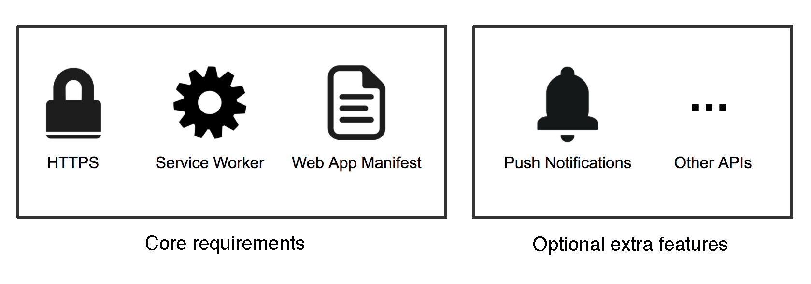

# Introdução ao PWA (_Progressive Web App_)

É um termo usado para denotar uma nova metodologia de desenvolvimento de software. Ao contrário dos tradicionais aplicativos, um [Progressive Web App](https://github.com/zeit/next.js#automatic-code-splitting) pode ser visto como uma evolução híbrida entre as páginas da web regulares (ou sites) e um aplicativo móvel. Este novo modelo de aplicação combina recursos oferecidos pelos mais modernos navegadores, com as vantagens de uso de um celular.

# Caracteristicas
 - Progressivo: para qualquer usuário, independente do browser
 - Responsivo: feito para qualquer dispositivo: desktop, tablet e mobile
 - Conexão: funciona mesmo se o usuário estiver offline
 - App-like: o usuário se sente em um aplicativo nativo
 - Atualizado: não é necessário baixar atualizações do aplicativo, o browser simplesmente irá detectar e atualizar automaticamente graças ao [service worker](https://developers.google.com/web/fundamentals/primers/service-workers/).
 - Seguro: somente com https
 - Engajável: através de push notifications, o usuário pode ser constantemente engajado.
 - Instalável: é possível adicionar um ícone na tela principal do smartphone com apenas um clique.
