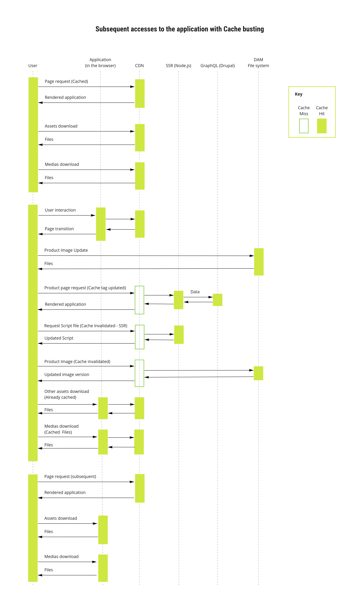

# Introdução ao _Cache Busting_

Quando um arquivo estático é armazenado em _cache_, ele pode permanecer por longos períodos de tempo antes que ele venha a expirar. Isso garante melhora considerável de performance. No entanto, pode apresentar pontos negativos em uma aplicação web em casos de atualização de _assets_ (arquivos estáticos tais como CSS, Scripts, Imagens, etc). Uma vez que a versão do arquivo em _cache_ é armazenada no navegador dos visitantes, os usuáros podem não conseguir ver novas atuaizações antes da expiração do _cache_. Isso se deve ao fato de que o navegador armazenará uma cópia dos arquivos em _cache_. O _Cache Busting_ propõe uma maneira de controlar sob demanda a utilização e expiração de _cache_ de arquivos estáticos.

## O que é _Cache Busting_

O procedimento de _cache busting_ resolve o problema do cache do navegador utilizando um mecanismo de identificação de versão, única e exclusiva, dos arquivos para informar ao navegador que uma versão atualizada está disponível. Deste modo, o navegador não recupera o arquivo em _cache_, pois fará uma nova chamada ao servidor para o arquivo com o identificador atualizado. 

É importante ressaltar que isso não impede o navegador de armazenar os arquivos em _cache_, ele apenas impede que ele o reutilize. 

### Exemplo básico

## Como e Porque utilizar _Cache Busting_

Essa técnica é útil pois permite que seus usuários recebam os arquivos mais recentes sem a necessidade de um _hard refresh_ (`Ctrl+F5`) ou de limpeza do cache do navegador. Desde modo, o uso do _cache busting_ é benéfico para que as últimas mudanças possam estar disponíveis praticamente em tempo real, mantendo todos os ganhos já previstos pelo uso de _Cache_ e proporcionado melhor experiência de usuário, aumento de retenção de visitas, especialmente em _mobile_. 

Algumas das maneiras de implementação recomandadas são:

- Versionamento de nome de arquivo (Ex. style.ksv-h1ai3sg-u7we.css)
- Versionamento de caminho (diretório) de arquivo (Ex. /ksv-h1ai3sg-u7we/style.css)
- Controle de Cache Tags no cabeçalho da requisição HTTP

Tanto o versionamento do nome como o caminho do arquivo são métodos recomendados de remoção de cache, pois não interferem em nenhum mecanismo de cache e podem ser facilmente atualizados para refletir um arquivo modificado.

O uso de _query strings_, apesar de ainda utilizada, é importante lembrar que esta alternativa não é recomedada como solução para _cache busting_ devido as implicações negativas de SEO e possíveis inconsistências devido a estar sujeita a configurções de proxy e/ou CDN.

De modo geral, sendo utilizado o versionamento de nome ou caminho do arquivo não há maiores configurações na utilização de _cache busting_ com uma CDN.

## Diagrama de sequencia um cenario com cache na CDN utilizando Cache Busting:
