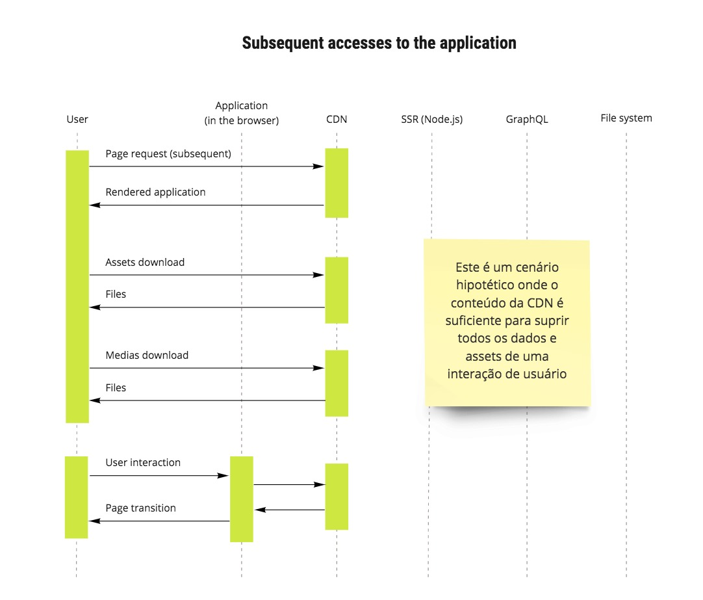

# Introdução ao Next.js

É um framework para aplicativos react que faz renderização do lado do servidor por padrão, entre muitas outras otimizações de desempenho como:
 - Divisão de código automática para cargas de página mais rápidas.
 - Ambiente de desenvolvimento baseado em Webpack que ofereça suporte a Hot Module Replacement (HMR)
 - Capaz de implementar com o Express ou qualquer outro servidor HTTP Node.js
 - Customizável com suas próprias configurações Babel e Webpack
 - [Code Splitting](https://github.com/zeit/next.js#automatic-code-splitting) automático com suporte a [dynamic imports](https://github.com/zeit/next.js#dynamic-import) para importação de arquivos em runtime.

Hoje todos estão familiarizados com o conceito de fadiga de JavaScript. Criar um aplicativo da web com JavaScript geralmente é difícil com todos os pacotes e opções que temos. React, webpack, Redux, React-router e muito mais bibliotecas e ferramentas são frequentemente usadas e exigem esforço para aprender.

Com o Next.js, habilitamos os desenvolvedores a criar aplicativos da web JavaScript com fluxo de trabalho mais direto. Basta criar alguns arquivos que exportam componentes do React e implantar seu aplicativo.

## Diagrama de sequencia um cenario sem cache na CDN:

## Diagrama de sequencia um cenario com cache na CDN:

