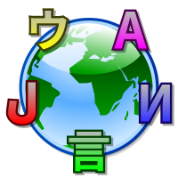

# Internacionalização de conteúdo e termos de interface

A internacionalização (i18n) de páginas tem como objetivo o controle e exibição do conteúdo e interface adaptáveis a diversas linguagens e culturas de acordo com dados e preferências do browser e do usuário.

# Tecnologias

As tecnologias escolhidas para esta prova de conceito foram:

- Módulos locale, translation do Drupal core
- Módulos contribuidos graphql, paragraphs
- Next.js
- React
- Apollo Client 2
- i18next

# Análise

Durante o processo de análise foram levantados os seguintes critérios:

- Testar internacionalização de paragraphs, revisions e entity references (taxonomias, etc)
- Testar fluxo de tradução de conteúdo
- Módulo GraphQL do Drupal: passando parâmetros para campo `route` e outros como de listagens (views) para que o conteúdo seja filtrado por um determinado idioma
- Internacionalização de interface React/Next integrado com strings do Drupal
- Negociação de idioma baseado em dados do browser, detectar automáticamente no idioma do browser e persistir
- Algum `language switcher` para poder mudar o idioma da app

# Abordagens

## Tradução de conteúdos

Para a tradução de conteúdos, foi utilizado o combo tradicional do Drupal 8 core para esta função. Com a adição do módulo _paragraphs_, que por sinal se integra bem com o sistema de internacionalização e também com o revisionamento de conteúdo.

## Tradução da APP/PWA

Aproveitamos o conceito de contextos do sistema de tradução do Drupal para agrupar traduções que podem relacionadas com a PWA como um todo ou uma parte específica da aplicação. Desta forma

# Fundamentos
 - A língua, contendo a codificação do texto em diferentes sistemas de escrita (Alfabetos), diferentes sistemas numerais, scripts da esquerda-para-direita e scripts da direita-para-esquerda (por exemplo, para língua hebraica). Os sistemas atuais utilizam Unicode para solucionar problemas de codificação de caracteres. Contendo também a representação gráfica do texto, o áudio e os subtítulos para vídeos;
 - O formato de data e tempo, incluindo diferentes calendários;
 - As diferentes formatações de números;
 - O fuso horário (UTC) de cada país para coincidir com a língua a ser internacionalizada;
 - Os números pré-definidos governamentalmente como: passaportes, RG, CPF;
 - Os padrões de números de telefones, endereço e códigos postais internacionais;
 - Os pesos e medidas de cada país;
 - O tamanho de papéis;
 - A moeda local;
 - Nomes e títulos locais.
