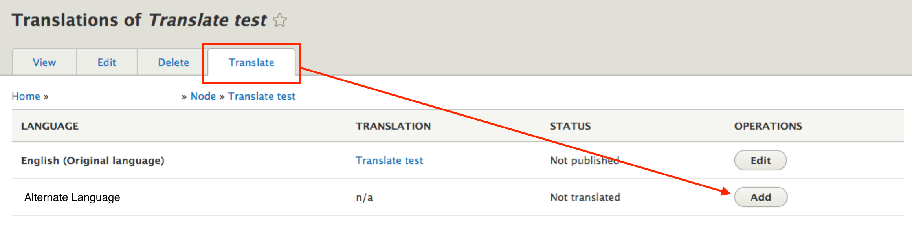
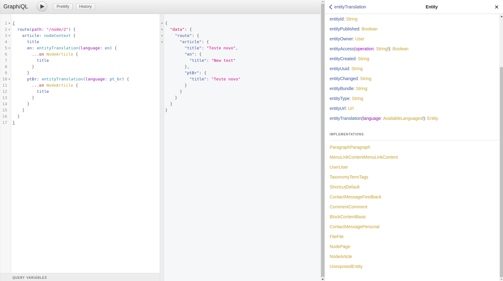

# Internacionalização de conteúdo

No Drupal, o principal método de tradução de conteúdo é a utilização do módulo de tradução (content_translation), desta forma apenas uma entidade é criada por conteúdo, e a tradução deste coteúdo se torna uma entidade independente apenas com os campos marcados para serem traduzidos.

## Configurando um conteúdo para ser traduzido

Configuramos os conteúdos a serem traduzidos acessando o menu: `Configuration > Content language and translation`.

Este módulo nos permite escolher quais conteúdos e campos de conteúdos que vamos habilitar para serem traduzidos.

## Traduzindo um conteúdo

Uma vez que foram definidos os conteúdos e seus respectivos campos que podem ser traduzidos, e também que exista pelo menus dois idiomas configurados e habilitados no drupal, podemos prosseguir efetivamente com a tradução de conteúdos.

Usuários com permissão para traduzirem os conteúdos podém visualizar a aba "Translate" na edição de um conteúdo, onde através desta aba será possível adicionar uma tradução para cada idioma habilitado no Drupal.

Na estrutura do Drupal, todas os conteúdos traduzidos tem o mesmo ID, pois as traduções são independentes da entidade relacionada.

## Acessando os conteúdos traduzidos pelo GraphQL

Primeiramente devemos habilitar o módulo GraphQL para o Drupal, desta forma boa parte das entidades são mapeadas para serem utilizadas pelo GraphQL.

Utilizamos a ferramenta GraphQL Explorer para realizar as consultas pelo GraphQL.

Realizamos a consulta ao node do tipo artigo ID 2 através da sua rota `/node/2` onde informamos quais os campos que a consulta irá retornar e quais as traduções através da função `entityTranslate` onde como argumento identificamos qual o idioma de tradução a ser retornado.

