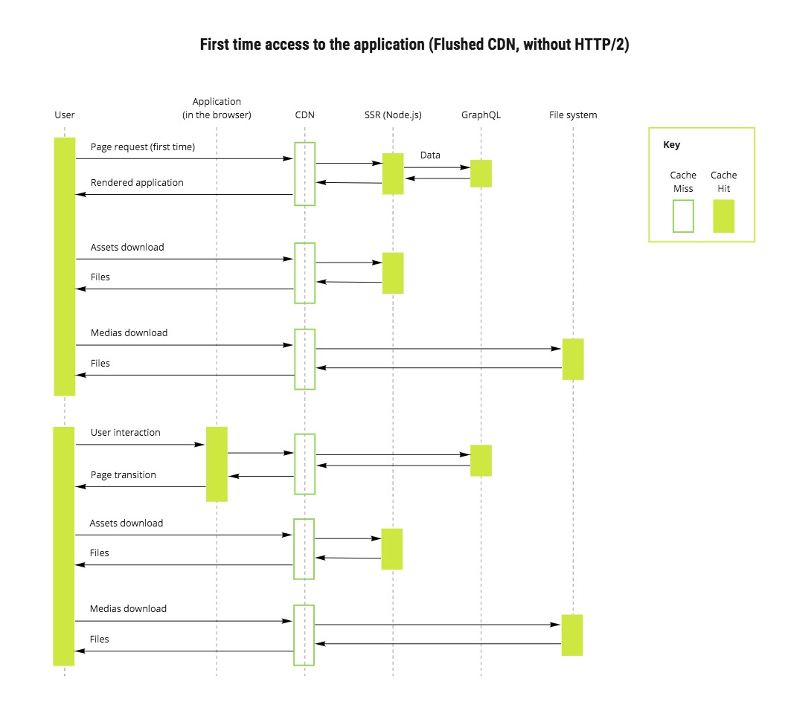

# Introdução


É um framework para aplicativos react que faz renderização do lado do servidor por padrão, entre muitas outras otimizações de desempenho como:
 - Divisão de código automática para cargas de página mais rápidas.
 - Ambiente de desenvolvimento baseado em Webpack que ofereça suporte a Hot Module Replacement (HMR)
 - Capaz de implementar com o Express ou qualquer outro servidor HTTP Node.js
 - Customizável com suas próprias configurações Babel e Webpack

Hoje todos estão familiarizados com o conceito de fadiga de JavaScript. Criar um aplicativo da web com JavaScript geralmente é difícil com todos os pacotes e opções que temos. React, webpack, Redux, React-router e muito mais bibliotecas e ferramentas são frequentemente usadas e exigem esforço para aprender.

Com o Next.js, habilitamos os desenvolvedores a criar aplicativos da web JavaScript com fluxo de trabalho mais direto. Basta criar alguns arquivos que exportam componentes do React e implantar seu aplicativo.

# Fluxograma de uso prático:


## Como funciona o Next.js ?
Criamos nosso projeto e inicializamos um pacote `package.json`:
```bash
  $ mkdir nextjs
  $ cd nextjs
  $ npm init -y
```
Em seguida, instalamos Next.js e as dependências do React e criamos um diretório de páginas:
```bash
  $ npm install --save next react react-dom
  $ mkdir pages
```
> pages - Next.js estende essa estrutura introduzindo um subdiretório de páginas onde seus componentes de nível superior vivem. Com isso ele faz o mapeamento das rotas.

No diretório `pages`, criamos um arquivo em `pages/index.js` com o seguinte conteúdo:
```javascript
  import React from 'react'
  import Link from 'next/link'
  import { setTimeout } from 'timers';

  class Home extends React.Component {
    static getInitialProps(ctx) {
      return new Promise((resolve, reject) => {
        setTimeout(() => {
          resolve({ name: 'Taller' })
        }, 500)
      })
    }
    render() {
      return (
        <h1>{this.props.name}</h1>
      )
    }
  }

  export default Home
```
> getInitialProps - É uma ótima função para o nível superior dos componentes (page). Ele dá acesso a uma série de propriedades, como a solicitação e objetos de resposta e informações de URL, como o nome do caminho.

Nós também criamos um arquivo chamado `pages/about.js` contendo este código:
```javascript
  import React from 'react'

  const About = () => (
    <h2>About poc</h2>
  )

  export default About
```
Adicionamos um script para o servidor de desenvolvimento ao `package.json`:
```json
  "scripts": {
    "dev": "next",
    "build": "next build",
    "start": "next start"
  }
```
Nós executamos esse script para iniciar o servidor de desenvolvimento:
```bash
  $ npm run dev
```
